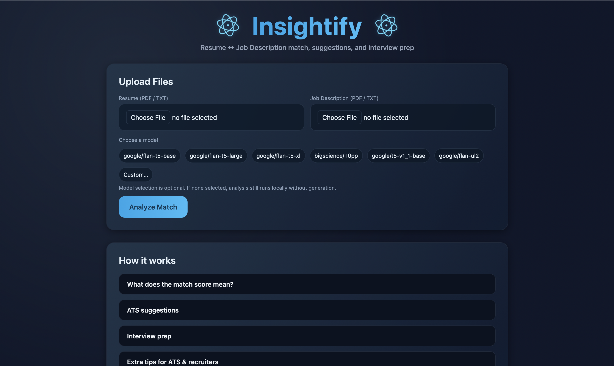
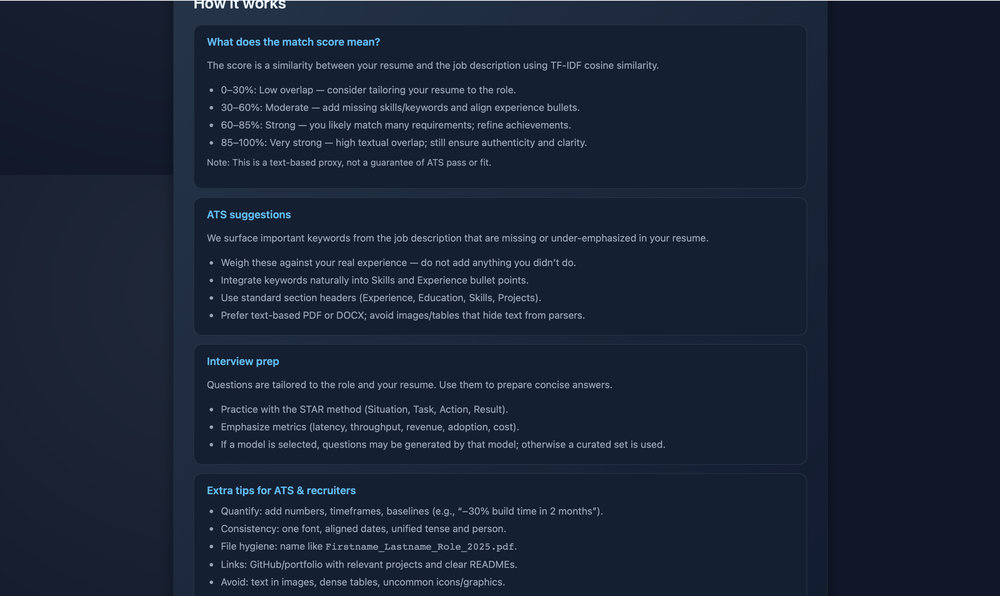
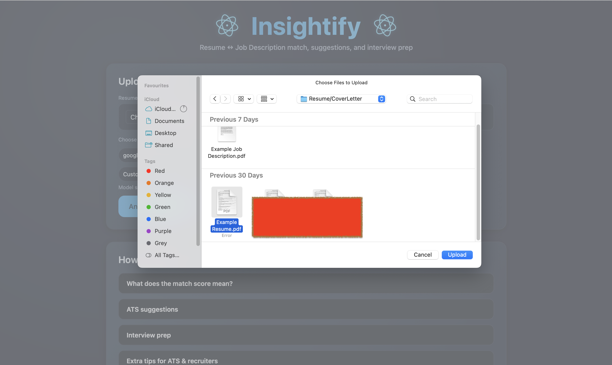
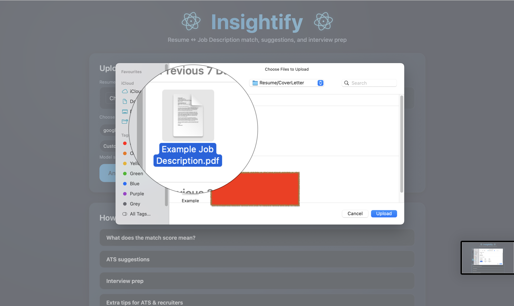
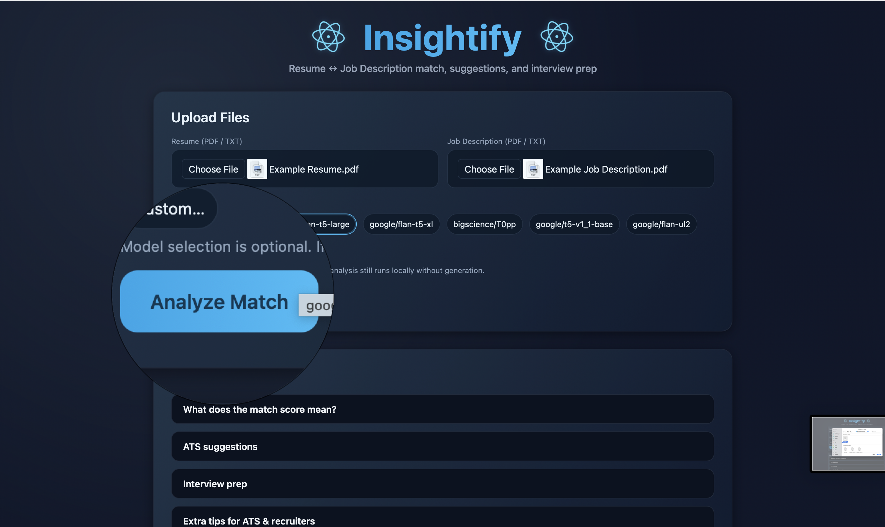
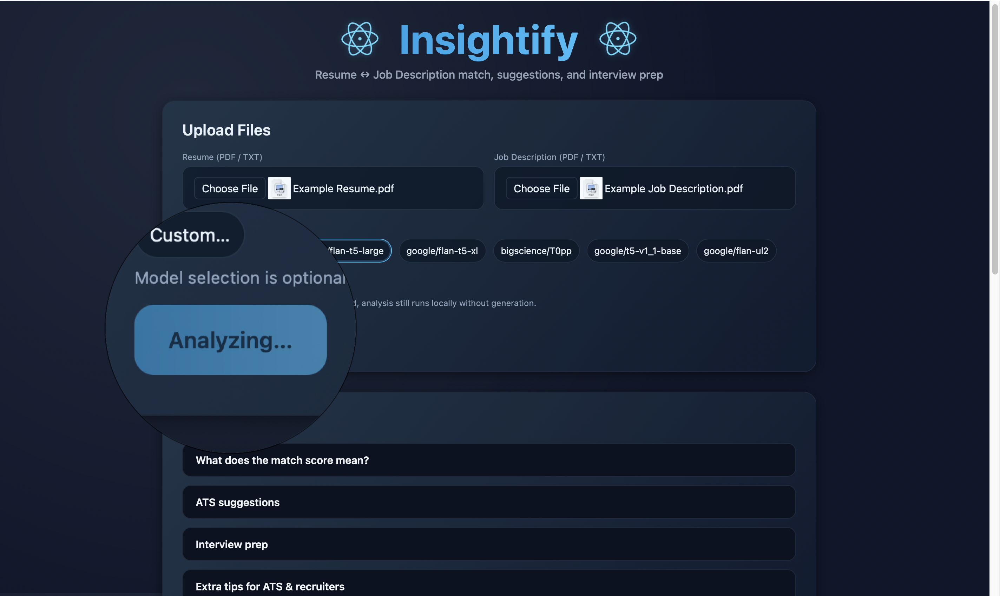
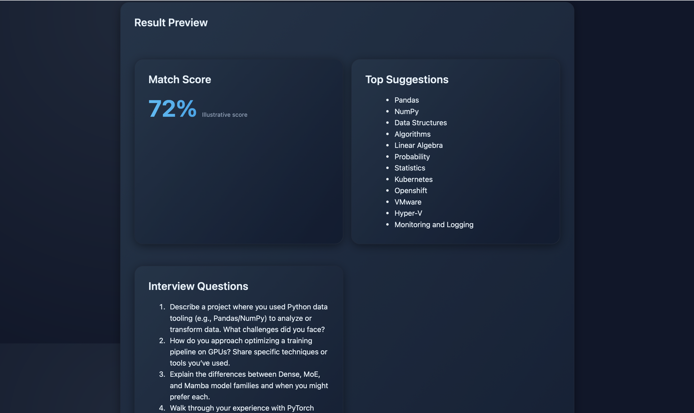
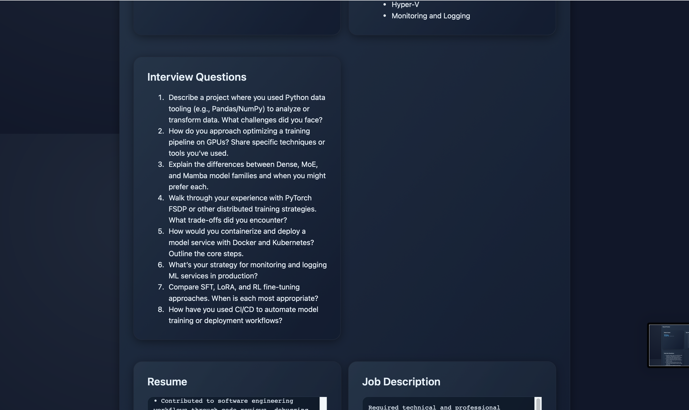
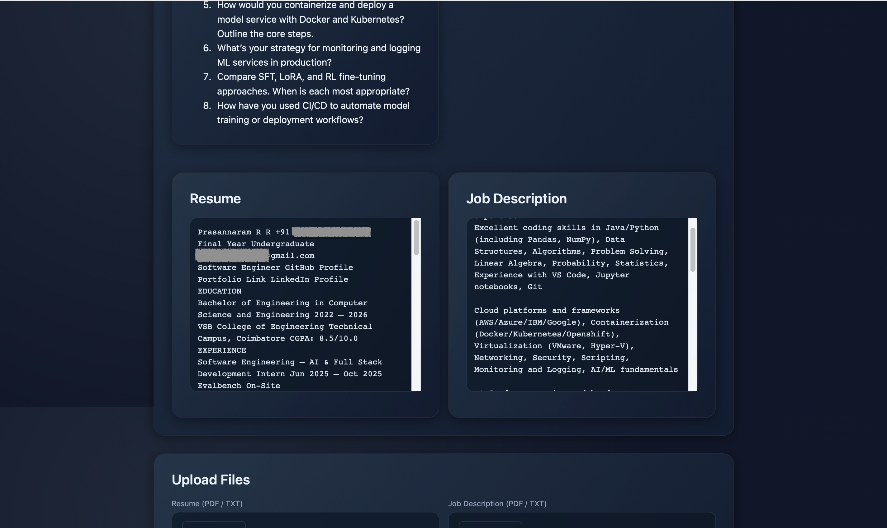

# Insightify — Resume ↔ Job Match Analyzer

Insightify analyzes a resume against a job description to produce:
- ATS-style keyword suggestions missing from the resume
- A match score (TF‑IDF cosine) between resume and JD
- Interview preparation questions (optionally via a selected model)
- A downloadable checklist of improvements

Tech stack:
- Backend: FastAPI (Python), scikit-learn, pdfplumber/PyPDF2, MongoDB (optional)
- Frontend: React + Vite

Live development defaults:
- API: http://localhost:8000
- Frontend: http://localhost:5175

---

## Features

- Upload resume and job description (PDF/TXT)
- Calculate an ATS-like textual match score using TF‑IDF cosine similarity
- Surface missing/under-emphasized keywords as suggestions
- Generate interview questions using a selected model (requires API token)
- Save past analyses to MongoDB and download a resume improvement checklist
- “How it works” guide embedded in the UI

---

## Quickstart (Local)

Backend

```bash
cd backend
python -m venv .venv
source .venv/bin/activate
pip install -r requirements.txt
cp .env.example .env  # then edit values as needed
uvicorn app:app --host 0.0.0.0 --port 8000 --reload
```

Frontend

```bash
cd frontend
npm install
npm run dev
# open the printed URL (typically http://localhost:5175)
```

---

## Environment Variables

Backend (`backend/.env`):
- MONGO_URI: MongoDB connection string (optional). Example: `mongodb://localhost:27017` or Atlas URI.
- DB_NAME: Database name (default: `insightify`).
- LLM_PROVIDER: `huggingface` (currently supported provider).
- HF_API_TOKEN: Token for model generation (optional; required to use models).
- HF_MODEL: Default model name when client does not choose one (default: `google/flan-t5-base`).
- HF_ALLOWED_MODELS: Comma‑separated list of allowed models. Example: `google/flan-t5-base,google/flan-t5-large,google/flan-t5-xl,bigscience/T0pp,google/t5-v1_1-base,google/flan-ul2`.

Notes:
- If `MONGO_URI` is omitted or not reachable, the app still works but `/history` will return an error.
- If `HF_API_TOKEN` is omitted, interview questions will fall back to a curated local list.

---

## API Reference

Base URL: `http://localhost:8000`

### POST /analyze
Multipart form fields:
- `resume`: file (.pdf or .txt)
- `jd`: file (.pdf or .txt)
- `use_hf`: `"true" | "false"` — whether to use a model for questions (optional)
- `model`: `string` — model id (optional; used when `use_hf` is true). If not provided, server uses `HF_MODEL`.

Response (JSON):
```json
{
	"match_score": 0.72,
	"suggestions": ["Pandas", "Kubernetes", "FSDP"],
	"interview_questions": ["Q1", "Q2", "..."],
	"checklist_file": "data_outputs/checklist_1762872607.txt",
	"model_used": "google/flan-t5-base"
}
```

### GET /history?limit=20
Returns recent analyses (requires MongoDB). Each item includes `_id`, timestamps, `suggestions`, `interview_questions`, and `model_used` if any.

### GET /download/{fname}
Downloads a generated checklist by filename (served from `backend/data_outputs/`).

---

## Frontend UX Notes

- Choose a model: chip‑based selector with presets + a Custom option. If no model is chosen, analysis runs without generation.
- “How it works” section explains the score scale, ATS suggestions, interview prep, and recruiter/ATS tips.
- Results show:
	- Match Score (percentage)
	- Suggestions (keywords to add/emphasize)
	- Interview Questions (and a badge with the model used, when applicable)
	- Checklist download link

---

## Screenshots


<table>
	<tbody>
		<tr>
			<td></td>
			<td></td>
			<td></td>
		</tr>
		<tr>
			<td></td>
			<td></td>
			<td></td>
		</tr>
		<tr>
			<td></td>
			<td></td>
			<td></td>
		</tr>
	</tbody>
  
</table>

---

## Database (MongoDB)

- Local: install MongoDB locally and set `MONGO_URI=mongodb://localhost:27017`.
- Atlas: create a free cluster and use the connection string in `MONGO_URI`.
- Collection: `analysis` inside `DB_NAME` (default `insightify`).
- `/history` is available only when MongoDB is reachable.

---

## Docker (Quick Methods)

Below are example containerization approaches. If you want, we can add Dockerfiles and a docker-compose.yml to the repo.

Option A — Run Backend in Docker

```Dockerfile
# backend/Dockerfile
FROM python:3.11-slim
WORKDIR /app
COPY backend/requirements.txt ./
RUN pip install --no-cache-dir -r requirements.txt
COPY backend/ ./
ENV PORT=8000
CMD ["uvicorn", "app:app", "--host", "0.0.0.0", "--port", "8000"]
```

Build & run:
```bash
docker build -t insightify-backend -f backend/Dockerfile .
docker run --env-file backend/.env -p 8000:8000 insightify-backend
```

Option B — Build Frontend and Serve

```Dockerfile
# frontend/Dockerfile
FROM node:20-alpine AS build
WORKDIR /app
COPY frontend/package.json frontend/package-lock.json ./
RUN npm ci
COPY frontend/ ./
RUN npm run build

FROM nginx:alpine
COPY --from=build /app/dist/ /usr/share/nginx/html
EXPOSE 80
```

Build & run:
```bash
docker build -t insightify-frontend -f frontend/Dockerfile .
docker run -p 8080:80 insightify-frontend
# open http://localhost:8080
```

Option C — Docker Compose (backend + frontend + mongo)

```yaml
version: "3.9"
services:
	mongo:
		image: mongo:6
		restart: unless-stopped
		ports: ["27017:27017"]
		volumes: ["mongo-data:/data/db"]

	backend:
		build:
			context: .
			dockerfile: backend/Dockerfile
		env_file: backend/.env
		depends_on: [mongo]
		ports: ["8000:8000"]

	frontend:
		build:
			context: .
			dockerfile: frontend/Dockerfile
		depends_on: [backend]
		ports: ["8080:80"]

volumes:
	mongo-data:
```

---

## Deploy to AWS (Methods)

Option 1 — EC2 (Simple & Flexible)
1. Provision an EC2 instance (Ubuntu LTS), open security group ports: 80/443 (HTTP/HTTPS), and 8000 if needed for direct API access.
2. Install Docker and docker compose plugin.
3. Copy project files (or build images locally and push to a registry).
4. Use Dockerfiles/Compose above to run backend, frontend (Nginx), and MongoDB (or use Atlas).
5. Put Nginx (or an Application Load Balancer) in front. Example Nginx reverse proxy:

```nginx
server {
	listen 80;
	server_name your-domain.com;
	location /api/ {
		proxy_pass http://127.0.0.1:8000/;
		proxy_set_header Host $host;
		proxy_set_header X-Real-IP $remote_addr;
	}
	location / {
		proxy_pass http://127.0.0.1:8080/;
	}
}
```

Add HTTPS with certbot (Let’s Encrypt). Point your domain DNS to the EC2 public IP or load balancer.

Option 2 — Frontend on S3 + CloudFront, Backend on EC2
1. Build frontend (`npm run build`) and upload `frontend/dist` to an S3 bucket (static website hosting disabled; use CloudFront).
2. Create a CloudFront distribution with the S3 bucket as origin.
3. Deploy backend on EC2 with Uvicorn/Nginx or Docker.
4. Configure CORS to your CloudFront domain.

Option 3 — Containers on ECS/Fargate
1. Push images to ECR.
2. Create a Fargate service (one task for backend, optionally another for a frontend Nginx).
3. Put an Application Load Balancer in front with listeners for 80/443 and target groups mapped to tasks.
4. Store secrets (HF token, Mongo URI) in AWS Secrets Manager or SSM Parameter Store and inject into the task.

---

## Security & Production Hardening

- Restrict CORS: set `allow_origins` in `backend/app.py` to your frontend domain.
- Secrets: keep tokens out of VCS; use environment stores (Dotenv locally, Secrets Manager in cloud).
- Upload limits: set request body size limits to avoid very large PDFs.
- Allowed models: enforce via `HF_ALLOWED_MODELS` (already supported at runtime).
- Observability: add structured logging and request metrics; consider a reverse proxy (Nginx) for TLS and rate limiting.

---

## Troubleshooting

- MongoDB connection refused: Start Mongo locally or use Atlas; ensure `MONGO_URI` is reachable.
- Ports 5173/5174 busy: Vite auto-selects another port (shown in the terminal); open that URL.
- HF API token errors: Ensure `HF_API_TOKEN` is set server-side and the model is accessible to your token.
- PDF text empty: `pdfplumber` tries first; fallback to `PyPDF2`; for image-only PDFs use OCR before uploading.

---

## Contributing / Next Steps

- History UI: add a simple page listing past analyses from `/history`.
- Vite dev proxy: eliminate CORS in dev by proxying `/analyze` to `localhost:8000`.
- Dockerization: check in `Dockerfile`s and `docker-compose.yml` to simplify cloud deployment.
- CI: add lint/format checks and a basic build workflow.

---

## License

This project is licensed under the MIT License. See the `LICENSE` file for details.
